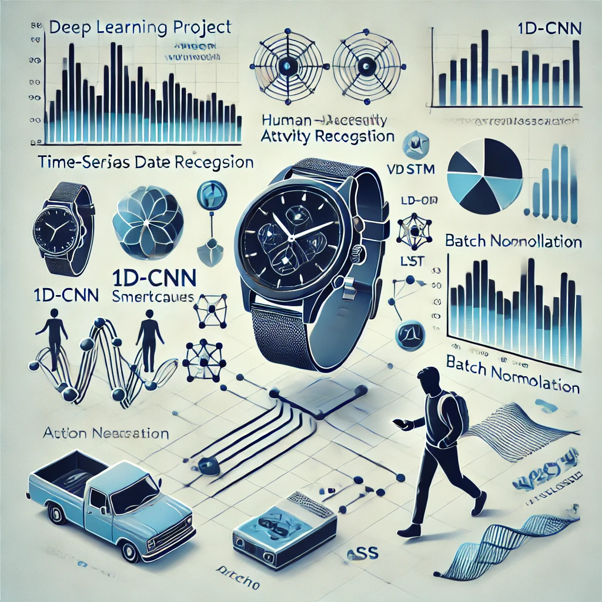

# Human Activity Recognition with Deep Learning


## Overview
This project implements deep learning techniques for human activity recognition using time-series data from smartwatches and VICON motion capture systems. It compares 1D-CNN and LSTM architectures, integrates autoencoder-based pretraining, and applies advanced model improvements to enhance performance.

## Key Features
- Sensor data from smartwatch (acceleration) and VICON (position).
- Custom 1D-CNN and LSTM models trained on each dataset.
- Autoencoder pretraining for enhanced feature extraction.
- Bidirectional LSTM, Dropout, Batch Normalization, and Adaptive Pooling.
- Classical machine learning benchmark using Random Forest.
- Naive baseline implementation for comparison.

## Technologies Used
- Python
- PyTorch
- NumPy, Pandas
- Scikit-learn
- Matplotlib, Seaborn

## Project Structure
- `main.ipynb`: Training, evaluation, model improvements and comparisons.
- `Report.pdf`: Full documentation including methodology, results, and insights.

## Dataset
- Sensor-based activity classification data: Smartwatch and VICON motion capture recordings.
- Data includes acceleration and position values along x, y, z axes for multiple users.
- Activities include: walking, stairs up/down, using phone, typing, writing, etc.

## Model Variants
- Base 1D-CNN & LSTM models.
- Improved models with:
  - Extra convolutional layers (CNN)
  - Bidirectional LSTM
  - Dropout & BatchNorm
  - Adaptive Pooling
- Autoencoder pretraining using unlabeled datasets (Zenodo, MotionSense).

## Evaluation Strategy
- User-level train-validation split to ensure generalization to unseen users.
- Accuracy, loss, and classification reports for each model variant.
- Cross-validation for classical ML models.

## Performance Summary
| Model Variant | Smartwatch Accuracy | VICON Accuracy | Weighted Avg Accuracy |
|---------------|---------------------|----------------|------------------------|
| Base CNN      | ~27%                | ~40%           | ~32%                   |
| Pretrained CNN| ~27%                | ~26%           | ~26%                   |
| Improved CNN  | ~36%                | ~50%           | ~47%                   |
| Base LSTM     | ~18%                | ~24%           | ~20%                   |
| Pretrained LSTM| ~29%               | ~31%           | ~28%                   |
| Improved LSTM | ~25%                | ~40%           | ~30%                   |

## Setup Instructions
1. Clone the repository:
```bash
git clone https://github.com/your-username/activity-recognition-deep-learning.git
cd activity-recognition-deep-learning
```
2. Install dependencies:
```bash
pip install torch scikit-learn pandas numpy matplotlib seaborn
```
3. Open and run the notebook:
```bash
jupyter notebook main.ipynb
```

## Reflection and Future Work
Although the final model performance metrics were moderate, this project provided significant insights into the complexities of sensor-based activity recognition. The results emphasize the importance of high-quality data, user variability, and architecture tuning in time-series classification. Future improvements may include:
- Collecting more diverse and balanced data.
- Incorporating attention mechanisms.
- Testing with Transformer-based architectures.
- Fine-tuning pretraining strategies and domain adaptation.

---
This project showcases the power of deep learning in analyzing sensor-based human activity, applying both traditional and modern modeling approaches, and leveraging transfer learning through autoencoder-based pretraining.

